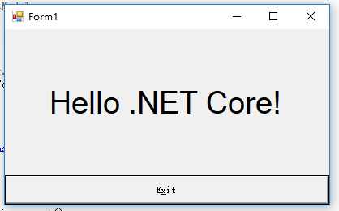

# WinForm.js

使用 HTML 和 JS 构建用户界面，编译为原生 WinFoms 的 exe 程序，也可运行于 web 平台

# 项目基础

微软已经开源 WinForms 的 UI 技术，并且基于开源的 .NET Core 3+ 可构建 UI 程序

路线图和计划见 Wiki

讨论 QQ 群： 182894490


# 第一步：HTML web 组件进行界面开发

请参见 web-vue 目录下的 readme 文件


# 第二步：使用 WinFrom.js 转换器进行项目编译转换

# Awesome-Replacer

简单的替换工具， 渐进式开发 compiler 所用

## CLI

**npm**

```
npm start
```

**yarn**

```
yarn start
```


# 第三步：运行 WinForm 程序，并补充C#逻辑

下载好 .Net Core 3 之后，然后拿 VS 2019 打开项目。

运行效果如下：




# 相关项目

微软 WinForm 开源地址： <https://github.com/dotnet/winforms>

.NET Core 3 下载： https://www.microsoft.com/net/download

VS2019 下载：<https://visualstudio.microsoft.com/zh-hans/vs/preview/?rr=https%3A%2F%2Fblogs.msdn.microsoft.com%2Fvisualstudio%2F2018%2F12%2F04%2Fmaking-every-developer-more-productive-with-visual-studio-2019%2F%3FWT.mc_id%3Dsocial-reddit-marouill>

基于 Core3 的桌面示例程序，见微软官方库 <https://github.com/dotnet/samples/tree/master/windowsforms>
