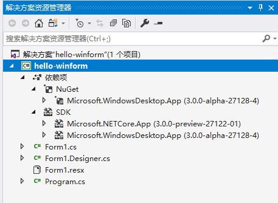
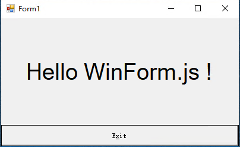

# WinForm.js

使用 HTML 和 JS 构建用户界面，编译为原生 WinFoms 的 exe 程序，也可运行于 web 平台

# 项目基础

微软已经开源 WinForms 的 UI 技术，并且基于开源的 .NET Core 3+ 可构建 UI 程序

路线图和计划见 Wiki

讨论 QQ 群： 182894490

# 相关项目

微软 WinForm 开源地址： <https://github.com/dotnet/winforms>

.NET Core 3 下载： https://www.microsoft.com/net/download

VS2019 下载：<https://visualstudio.microsoft.com/zh-hans/vs/preview/?rr=https%3A%2F%2Fblogs.msdn.microsoft.com%2Fvisualstudio%2F2018%2F12%2F04%2Fmaking-every-developer-more-productive-with-visual-studio-2019%2F%3FWT.mc_id%3Dsocial-reddit-marouill>

# 基于.NET Core 构建 WinForm 示例程序

下载好 .Net Core 3 之后，在命令行运行

> dotnet new winforms

自动产生 winforms 的项目，然后拿 VS 2019 打开项目。

更多基于 Core3 的桌面示例程序，见微软官方库 <https://github.com/dotnet/samples/tree/master/windowsforms>

# 基于 WinFrom.js 的 hello 模板运行示例程序

使用 VS 2019 打开本项目 hello-winform 目录下的 csproject 文件，

VS2019 会自动加载项目，点击运行，即可运行起来基于 core 3 的 APP 项目

解决方案显示如下：



运行效果如下：



# 使用 WinFrom.js 的转换器进行项目编译转换

# Awesome-Replacer

简单的替换工具， 渐进式开发 compiler 所用

## CLI

**npm**

```
npm start
```

**yarn**

```
yarn start
```

# HTML web 组件使用指南

请参见 web-vue 目录下的 readme 文件
